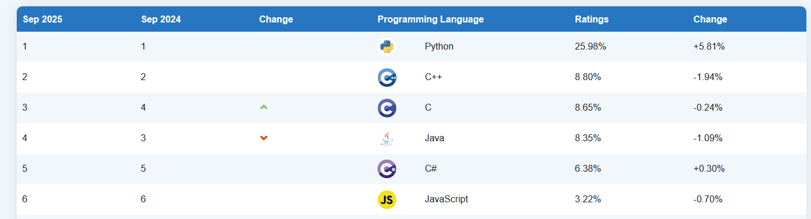
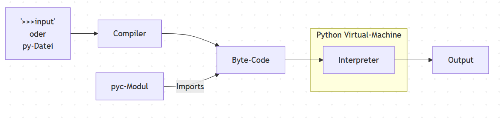

# Einführung in Python

## Angewandete KI für Entscheidungsprozesse
<!-- _footer: 'Angelehnt an  Downey (2015), *Think Python (3e)* — O’Reilly. [ISBN 978-1491939406](https://allendowney.github.io/ThinkPython/chap01.html)' -->
---

# Inhalt

1. Grundlagen von Python
1. Variables, Data Types and Statements
2. Functions and Return Values
3. Conditionals and Loops
4. Collections
5. Iteration 
6. Classes
7. Wichtige Bibliotheken: numpy, matplotlib


---
# Grundlagen von Python
## Warum Python?


* Python hat eine vergleichbar einfache Syntax.

<style scoped>
pre {
  display: inline-block !important;
  width: 49% !important;
  vertical-align: top;
  margin: 0;
  box-sizing: border-box;
  max-height: 300px;  /* scroll if long */
  overflow: auto;
}

pre code { font-size: 0.85em; line-height: 1.35; }
pre:has(> code.language-cpp) {
  margin-bottom: 104px;
}
</style>

### C++ vs Python

```python
from collections import Counter
import re, sys

text = sys.stdin.read().lower()
words = re.findall(r"[a-z']+", text)
for w, c in Counter(words).most_common(10):
    print(f"{w}: {c}")
```

```cpp
#include <algorithm>
#include <cctype>
#include <iostream>
#include <iterator>
#include <regex>
#include <string>
#include <unordered_map>
#include <utility>
#include <vector>

int main() {
    const std::string input{
        std::istreambuf_iterator<char>(std::cin),
        std::istreambuf_iterator<char>()
    };

    std::string text = input;
    std::transform(text.begin(), text.end(), text.begin(),
                   [](unsigned char c) { return static_cast<char>(std::tolower(c)); });

    const std::regex word_re("[a-z']+");
    std::unordered_map<std::string, std::size_t> freq;
    for (std::sregex_iterator it(text.begin(), text.end(), word_re), end_it;
         it != end_it; ++it) {
        ++freq[it->str()];
    }

    std::vector<std::pair<std::string, std::size_t>> items;
    items.reserve(freq.size());
    for (const auto& kv : freq) {
        items.emplace_back(kv.first, kv.second);
    }

    const std::size_t k = std::min<std::size_t>(10, items.size());
    std::partial_sort(
        items.begin(), items.begin() + k, items.end(),
        [](const std::pair<std::string, std::size_t>& a,
           const std::pair<std::string, std::size_t>& b) {
            return a.second > b.second;
        });

    for (std::size_t i = 0; i < k; ++i) {
        std::cout << items[i].first << ": " << items[i].second << '\n';
    }
    return 0;
}

```
---
# Grundlagen von Python

## Warum Python?


* Python hat eine vergleichbar einfache Syntax.


* Python ist sehr beliebt.  [Quelle: TIOBE Rankings](https://www.tiobe.com/tiobe-index/)
  
---
# Grundlagen von Python

## Warum Python?


* Python hat eine vergleichbar einfache Syntax.

* Python ist sehr beliebt.  
    
* Python ist DIE Sprache für KI.z.B. Frameworks für KI: `pytorch`, `sk-learn`, `unified-planning`

--- 
# Grundlagen von Python
## Was ist Python?

* Python ist eine höhere, allgemein anwendbare (_engl. general-purpose_)   Programmiersprache. 
* Unterstützt verschiedene Programmierparadigmen wie z.B objektorientierte und funktionale Programmierung. 

--- 
# Grundlagen von Python 




---
# Grundlagen von Python 

## Wie führe ich einen Pythonquellcode aus?

* mit Python Interpreter
```bash
$python
Python 3.13.3 (tags/v3.13.3:6280bb5, Apr  8 2025, 14:47:33) [MSC v.1943 64 bit (AMD64)] on win32
Type "help", "copyright", "credits" or "license" for more information.
Ctrl click to launch VS Code Native REPL
>>> 4+5
9
>>> exit()
```
---
# Grundlagen von Python 

## Wie führe ich einen Pythonquellcode aus?


* als  einzelnes Skript für komplizierte Programme. 
  
``` python
import math
length = 4
width = 5
hypotenuse = math.sqrt(length**2 + width**2)
theta = math.arcsin(length / hypotenuse)
print(f"The angle is {theta} radians")
```

``` bash
$python test.py
The angle is 0.674 radians
```


---


# Grundlagen von Python 

## Wie führe ich einen Pythonquellcode aus?

* mit **Jupyter Notebook**
  * Kombination aus interaktivem Terminal und einzelnem Skript


---
<!-- _footer: 'https://jupyter-notebook.readthedocs.io/en/latest/notebook.html' -->
# Grundlagen von Python 

### Jupyter Notebook: 
  * Eine browserbasierte Oberfläche für einen REPL (read-evaluate-print-loop)-Kernel
  * Unterstützt Tabellen, Plots, HTML, Markdown und "in-place"-Ausführung von Zeilen
  
### Kernels
  * Programmiersprachenspezifische Prozesse, die unabhängig von der Jupyteranwendung laufen.
  * Kommuniziert mit der Jupyteranwendung über Schnittstellen.
  * Speichert den Zustand, bis der Kernel neu gestartet wird.


---