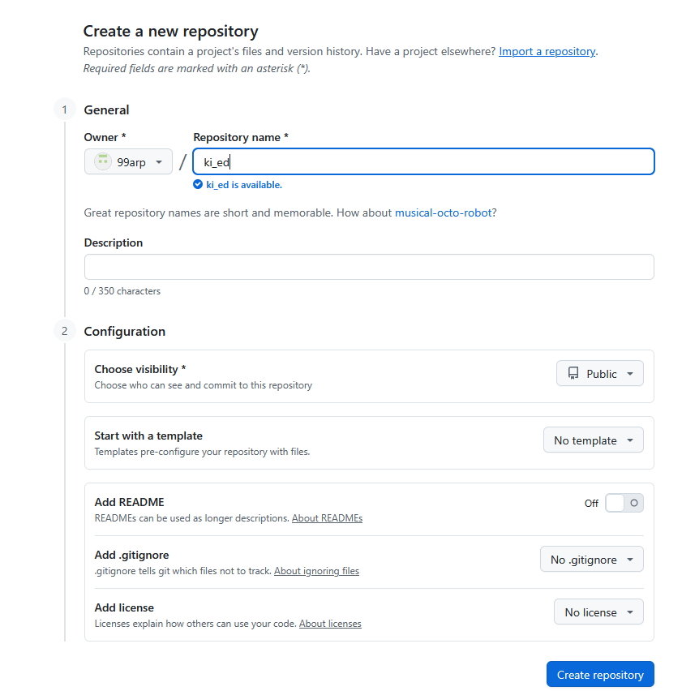

# For the slides 
1. Install VScode MARP extension. 

- The Notebook has been tested using python 3.13.3


# Wenn du dein Arbeitsstand speichern willst. 

1. Das Notebook an sich selbst per E-Mail schicken 
2. Das Notebook in einem USB-Stick speichern 
3. Dein Arbeitsordner mit Github synchronisieren. 

## Mit Github synchronisieren


1. Erstelle einen Ordner auf dem **Desktop**. Hier speicherst du alle deine **Jupyter-Notebooks** aus dieser Vorlesung.

2. Wenn du noch keinen **GitHub**-Account hast, erstelle dir einen: [GitHub-Account](https://github.com/).

3. Erstelle ein neues GitHub-[Repository](https://docs.github.com/en/repositories/creating-and-managing-repositories/creating-a-new-repository)  
   

4. Füge dann ein neues Remote zu deinem Repo hinzu:
   ```bash
   git remote add origin https://github.com/99arp/ki_ed.git # dein GitHub-Link
   git branch -M main
   git push -u origin main
    ```

5. Wenn du mit deiner Arbeit fertig bist:
   
   ```
    git add filename         # filename ist der Name deiner Datei
    git commit -m "updated filename"
    git push                 # pusht standardmäßig in den main-Branch

   ```
6. Um deine Änderungen von GitHub zu holen (pull):
   ```
   git pull
   ```
