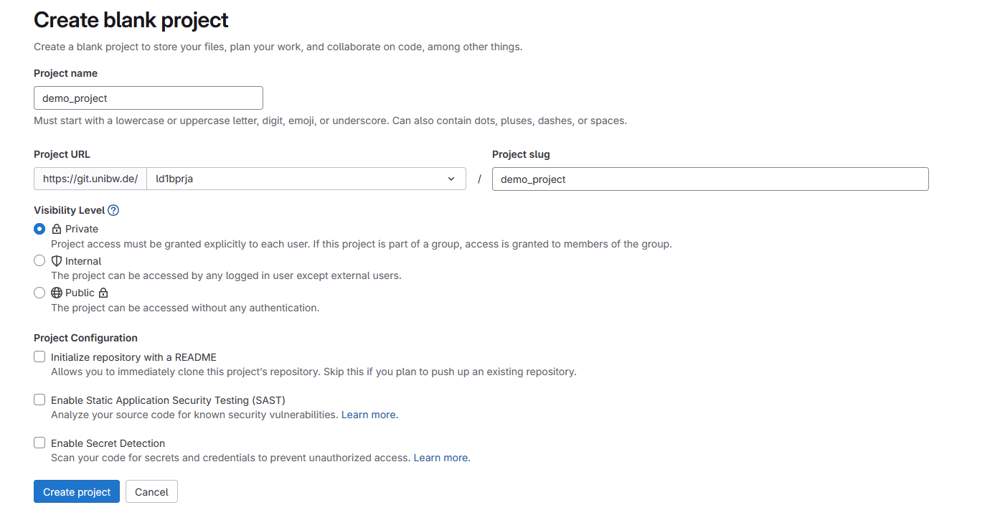

# For the slides 
1. Install VScode MARP extension. 

- The Notebook has been tested using python 3.13.3


# Wenn du dein Arbeitsstand speichern willst. 

1. Das Notebook an sich selbst per E-Mail schicken 
2. Das Notebook in einem USB-Stick speichern 
3. Dein Arbeitsordner mit Github synchronisieren. 

## Mit GitLab synchronisieren


1. Erstelle eine neue Repo: 
 
2. Personal Access Token [Einrichten](https://git.unibw.de/-/user_settings/personal_access_tokens?page=1&state=active&sort=expires_asc). Dieser Token dient als Passwort. Sicher speichern. 
3. Alternativ, wenn GitLab nicht vorhanden. 
    1. Wenn du noch keinen **GitHub**-Account hast, erstelle dir einen: [GitHub-Account](https://github.com/).

    2. Erstelle ein neues GitHub-[Repository](https://docs.github.com/en/repositories/creating-and-managing-repositories/creating-a-new-repository)  
    

3. Erstelle einen Ordner in Desktop und initialisiere eine Repo mit von Terminal `git init`
4. Adde diese Repo `git remote add origin https://git.unibw.de/ld1bprja/demo_project.git`
5. Adde Vorlesung Repo als upstream  `git remote add upstream https://github.com/99arp/ki_ep.git`
6. Verifiziere mit `git remote -v`
7. Stelle es so ein, dass die pushes in deiner Repo landen `git config remote.pushDefault origin`
   


8. Die Neue Datei für die Vorlesung pullst du mit `git pull upstream master`


9.  Wenn du mit deiner Arbeit fertig bist, um deinen Zustand zu speichern:
   
   ```
    git add filename         # filename ist der Name deiner Datei
    git add .  # Wenn du sämtliche Änderungen in allen Datein speichern willst
    git commit -m "updated filename"
    git push                 # pusht standardmäßig in den main-Branch

   ```
10. Um deine eigene Änderungen zu pullen (pull):
   ```
   git pull # pullt standardmäßig deine Version
   ```
